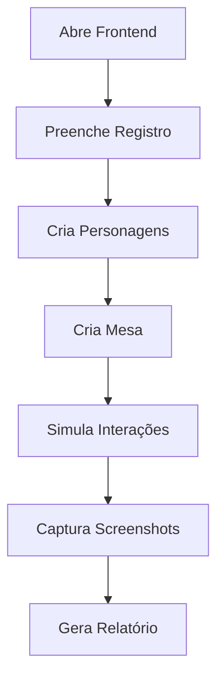

# 🤖 Automação de Interface Humana - Dungeon Keeper

## 🎯 Visão Geral

Este projeto oferece **duas soluções** para automação de interface que simula interações humanas reais:

1. **n8n + Puppeteer** (Recomendado para produção)
2. **Python + Selenium** (Alternativa sem Docker)

## 🔄 Diferença entre Automação de API vs Interface

### 📡 Automação de API (Atual)
- ✅ **Rápida e eficiente**
- ✅ **Testa lógica de negócio**
- ❌ **Não vê a interface real**
- ❌ **Não detecta bugs visuais**
- ❌ **Não valida UX**

### 🖥️ Automação de Interface (Nova)
- ✅ **Simula usuário real**
- ✅ **Testa interface visual**
- ✅ **Detecta bugs de CSS/layout**
- ✅ **Valida experiência do usuário**
- ✅ **Gera screenshots como evidência**
- ❌ **Mais lenta que API**

---

## 🎭 Opção 1: n8n + Puppeteer (Recomendado)

### 📋 Pré-requisitos
- Docker instalado
- n8n configurado
- Chrome/Chromium disponível

### 🚀 Como Usar

1. **Inicie o n8n:**
   ```bash
   cd n8n-automation
   start-n8n.bat
   ```

2. **Acesse o n8n:**
   - URL: http://localhost:5678
   - Usuário: admin
   - Senha: admin123

3. **Importe o workflow:**
   - Vá em "Import from file"
   - Selecione: `workflows/human-like-interface-testing.json`

4. **Ative o workflow:**
   - Clique em "Active" no workflow
   - Execução automática a cada 2 horas

### 🎯 O que o Workflow Faz



### 🔍 Testes Realizados
- **Registro:** Preenche formulário completo
- **Personagens:** Cria 3 personagens únicos
- **Mesa:** Cria mesa como mestre
- **Interações:** Chat, navegação, cliques
- **Visual:** Screenshots de todas as seções

---

## 🐍 Opção 2: Python + Selenium (Alternativa)

### 📋 Pré-requisitos
- Python 3.8+
- Chrome/Chromium instalado
- ChromeDriver compatível

### 📦 Instalação

```bash
# Instalar Selenium
pip install selenium

# Baixar ChromeDriver
# https://chromedriver.chromium.org/
# Adicionar ao PATH do sistema
```

### 🚀 Execução

```bash
# Executar automação
python selenium_ui_automation.py
```

### 🎯 O que o Script Faz

1. **Configura WebDriver** com Chrome
2. **Abre Frontend** (http://localhost:3001)
3. **Registra Usuário** preenchendo formulário
4. **Cria Personagens** (Aragorn, Legolas, Gimli)
5. **Navega Seções** (Inventário, Mesas, Histórias)
6. **Captura Screenshots** de cada etapa
7. **Gera Relatório** JSON detalhado

### 📊 Relatório Gerado

```json
{
  "session_id": "abc12345",
  "automation_type": "Selenium UI Automation",
  "summary": {
    "total_tests": 15,
    "successful_tests": 13,
    "success_rate": 86.7
  },
  "conclusions": {
    "interface_status": "Funcionando",
    "user_experience": "Boa"
  }
}
```

---

## 🎨 Personalização Avançada

### 🔧 Modificar Seletores CSS

```javascript
// n8n (Puppeteer)
await page.waitForSelector('.meu-botao-customizado');
await page.click('.meu-botao-customizado');
```

```python
# Python (Selenium)
element = driver.find_element(By.CSS_SELECTOR, '.meu-botao-customizado')
element.click()
```

### 📸 Capturas Personalizadas

```javascript
// n8n - Screenshot de elemento específico
const element = await page.$('.minha-secao');
const screenshot = await element.screenshot();
```

```python
# Python - Screenshot de página completa
driver.save_screenshot('minha_captura.png')
```

### ⏱️ Timing Humano

```javascript
// n8n - Pausa realista
await page.waitForTimeout(2000); // 2 segundos
```

```python
# Python - Digitação humana
for char in texto:
    element.send_keys(char)
    time.sleep(random.uniform(0.05, 0.2))
```

---

## 🔍 Comparação das Soluções

| Aspecto | n8n + Puppeteer | Python + Selenium |
|---------|-----------------|--------------------|
| **Facilidade** | ⭐⭐⭐⭐ | ⭐⭐⭐ |
| **Performance** | ⭐⭐⭐⭐⭐ | ⭐⭐⭐⭐ |
| **Agendamento** | ⭐⭐⭐⭐⭐ | ⭐⭐ |
| **Relatórios** | ⭐⭐⭐⭐⭐ | ⭐⭐⭐⭐ |
| **Manutenção** | ⭐⭐⭐⭐ | ⭐⭐⭐ |
| **Flexibilidade** | ⭐⭐⭐ | ⭐⭐⭐⭐⭐ |

---

## 🎯 Casos de Uso

### 🔄 Testes Contínuos
- **n8n:** Execução automática a cada 2 horas
- **Python:** Execução manual ou via cron/task scheduler

### 🐛 Debug de Interface
- **Ambos:** Screenshots automáticos para análise
- **Selenium:** Modo não-headless para visualização

### 📊 Validação de UX
- **Ambos:** Simulam jornada completa do usuário
- **n8n:** Relatórios visuais integrados

### 🚀 CI/CD Integration
- **n8n:** Webhooks para integração
- **Python:** Scripts em pipelines de deploy

---

## 🛠️ Solução de Problemas

### ❌ Chrome não encontrado
```bash
# Instalar Chrome
winget install Google.Chrome

# Ou especificar caminho
chrome_options.binary_location = "C:/Program Files/Google/Chrome/Application/chrome.exe"
```

### ❌ Elementos não encontrados
```python
# Aumentar timeout
WebDriverWait(driver, 30).until(
    EC.presence_of_element_located((By.CSS_SELECTOR, ".meu-elemento"))
)
```

### ❌ n8n não inicia
```bash
# Verificar Docker
docker --version

# Verificar portas
netstat -an | findstr :5678
```

---

## 🎉 Próximos Passos

1. **Escolha sua solução** (n8n ou Python)
2. **Configure o ambiente** seguindo os pré-requisitos
3. **Execute os testes** e analise os relatórios
4. **Personalize** conforme suas necessidades
5. **Integre** ao seu workflow de desenvolvimento

**🎯 Resultado:** Automação completa que testa sua interface exatamente como um usuário real faria!